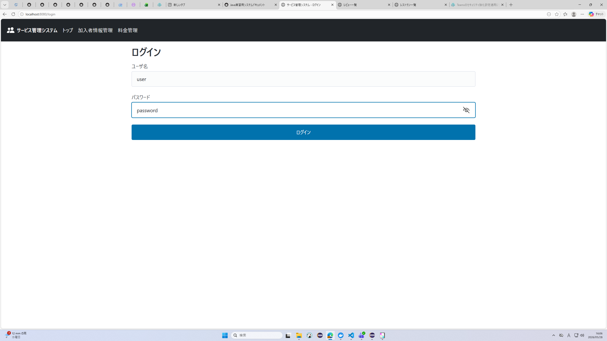
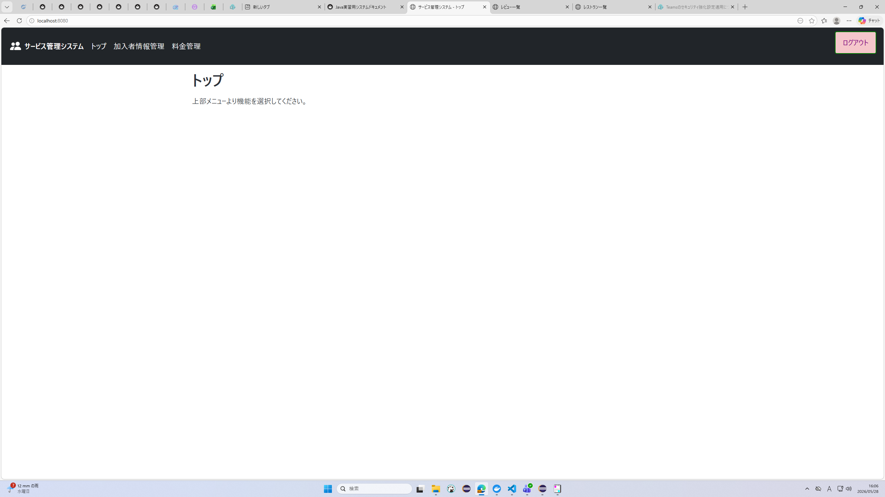
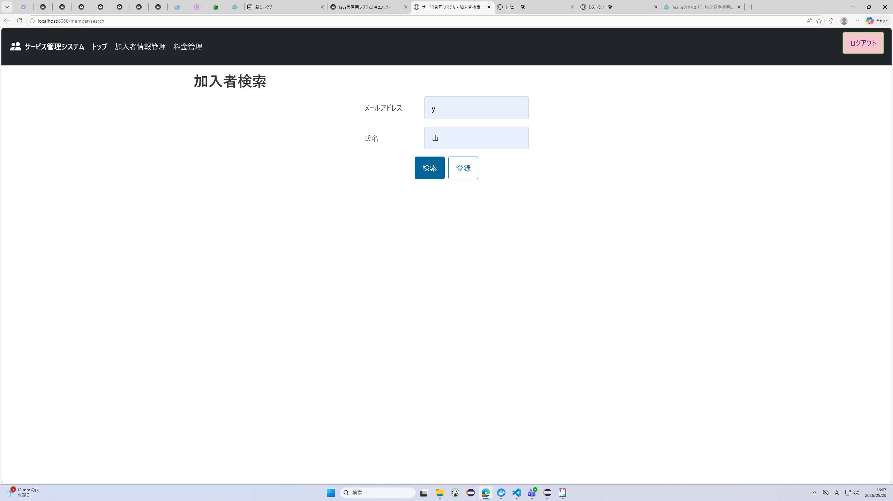
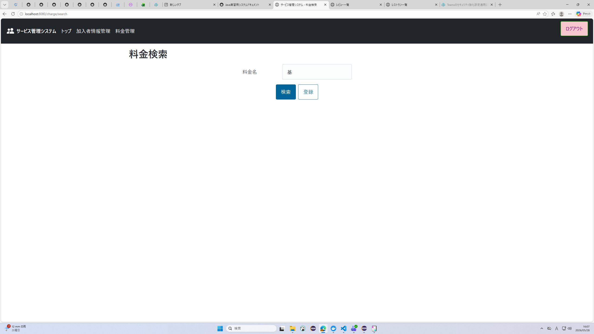
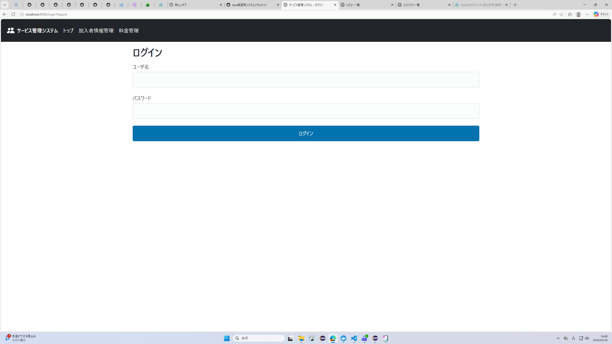

# 結合テスト仕様書

## ログインからログアウトまでの一連の操作
システムにログインし、各検索機能を実行し、ログアウトできることを確認する。

- [x] ログイン画面に登録されたユーザ名（今回は「user」）と正しいパスワード（今回は「password」）を入力して、ログインすることができる

- [x] 機能メニューで「加入者情報管理」をクリックし、加入者検索画面に遷移する

- [x] 機能メニューで「料金管理」をクリックし、料金検索画面に遷移する

- [x] 機能メニューで「トップ」をクリックし、トップ画面に遷移する

- [x] ログアウトボタンを押すとログアウトし、ログイン画面に遷移する
